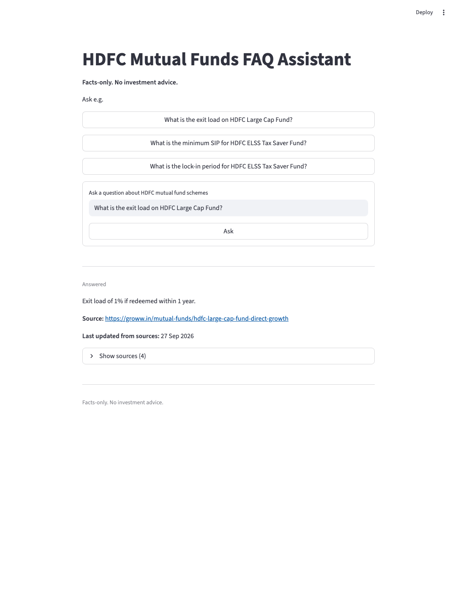

# HDFC Mutual Funds FAQ Assistant

A retrieval-augmented Q&A assistant over a snapshot corpus of **HDFC mutual fund**
scheme pages. It answers factual questions about fees, exit loads, minimum
investment, lock-in, and riskometer level, cites the page it read, shows how old
that page is, and **refuses** anything that drifts into advice, return
forecasting, or another AMC's funds.

> **Facts-only. No investment advice.**



*Screenshot: a real run against the real Groq backend and the real index. The
answer, the Groww citation, the `Last updated from sources` line, and the
`Show sources` expander are all live output.*

---

## Contents

- [What it does](#what-it-does)
- [Quickstart](#quickstart)
- [Architecture](#architecture)
- [The chunking decision and its rationale](#the-chunking-decision-and-its-rationale)
- [Retrieval calibration (`MIN_SCORE`)](#retrieval-calibration-min_score)
- [Guardrails](#guardrails)
- [Evaluation](#evaluation)
- [Sample Q&A](#sample-qa)
- [Repository layout](#repository-layout)
- [Tests and gates](#tests-and-gates)
- [Known limits](#known-limits)
- [Disclaimer](#disclaimer)
- [Sources](#sources)

---

## What it does

**Scope: one AMC, five schemes, plus regulator general material.**

| Scheme | Category | Plan |
|---|---|---|
| HDFC Large Cap Fund | Large Cap | Direct Growth |
| HDFC Equity Fund | Flexi Cap | Direct Growth |
| HDFC ELSS Tax Saver Fund | ELSS | Direct-Growth |
| HDFC Small Cap Fund | Small Cap | Direct Growth |
| HDFC Balanced Advantage Fund | Balanced Advantage | — |

Plus two AMFI (Association of Mutual Funds in India) pages, indexed as
`scope: general`, because the Groww scheme pages do not carry the ELSS lock-in
rule, the riskometer scale, or statement guidance.

**In scope:** expense ratio, exit load, minimum SIP / lump sum, lock-in, riskometer
level and benchmark, and what a statement of accounts is.

**Out of scope by design:** NAV, returns, CAGR, fund recommendations, scheme
comparison, and any non-HDFC AMC.

The corpus is **7 pages / 101,047 characters / 199 chunks**, indexed as 199
384-dimensional vectors. Every number in this README comes from a command in
this repository; nothing is estimated.

---

## Quickstart

Requires Python 3.9+. Developed and verified on macOS with Python 3.9.6.

```bash
# 1. environment
python3 -m venv .venv
source .venv/bin/activate
pip install -r requirements.txt

# 2. credentials — .env is git-ignored, never commit it
cp .env.example .env
$EDITOR .env          # set GROQ_API_KEY

# 3. build the index (fetch → chunk → embed → store)
python run_ingest.py

# 4. run it
streamlit run app.py
```

Then open <http://localhost:8501>.

### Step 3 takes a few minutes and needs network

`run_ingest.py` with no flags runs all four build stages: it downloads the seven
pages, extracts and cleans the text, splits them into chunks, embeds them with
`all-MiniLM-L6-v2` (downloaded once into `data/models/`), and writes the vectors
to a persistent ChromaDB collection in `data/chroma/`.

`data/` is git-ignored, so **a fresh clone has no index until you run step 3**.
The UI detects this and tells you to run `python run_ingest.py` instead of
raising a traceback.

Stages can be run separately, which is useful when iterating:

```bash
python run_ingest.py --fetch-only   # stage 1: fetch, extract, clean
python run_ingest.py --chunk        # stage 2: split into chunks + write strategy comparison
python run_ingest.py --index        # stages 3/4: embed and store
```

Re-running is safe: ingest converges rather than duplicating (see
`tests/test_vectorstore_idempotency.py`).

### Other ways to run it

```bash
python cli.py "What is the exit load on HDFC Large Cap Fund?"   # one question, cited answer
python cli.py "What is the exit load on HDFC Large Cap Fund?" --sources   # + the retrieved chunks
python cli.py --sample              # regenerate reports/sample_qa.md
python scripts/evaluate.py          # the 15-row golden set, end to end
python -m pytest -q                 # the full unit suite
```

A real `cli.py` run:

```
Q: What is the exit load on HDFC Large Cap Fund?
status: ANSWERED

Exit load of 1% if redeemed within 1 year.

Source: https://groww.in/mutual-funds/hdfc-large-cap-fund-direct-growth
Last updated from sources: 27 Sep 2026

(Facts-only. No investment advice.)
```

### If you would rather not use an API key

`config.LLM_BACKEND` also supports a local Ollama backend:

```bash
# in .env
LLM_BACKEND=ollama
OLLAMA_BASE_URL=http://localhost:11434
OLLAMA_MODEL=llama3.2
```

Retrieval, guards, and verification are backend-independent; only the generation
call changes. The numbers in this README were produced with the Groq backend.

> **Note on `GROQ_MODEL`.** `config.py` pins `GROQ_MODEL = "openai/gpt-oss-20b"`
> in code and reads `.env` for `GROQ_API_KEY` only. An uncommented
> `GROQ_MODEL=` line in `.env` is currently **ignored**. This is a known rough
> edge, listed under [Known limits](#known-limits).

---

## Architecture

```
┌──────────────────────────────────────────────────────────────────────────────┐
│                              PRESENTATION LAYER                              │
│                     Streamlit single screen (app.py)                         │
│  title + disclaimer · 3 example chips · input box · answer · citation ·      │
│  "Last updated from sources" · Show sources expander                          │
└───────────────────────────────────┬──────────────────────────────────────────┘
                                    │  user question (str)
                                    ▼
┌──────────────────────────────────────────────────────────────────────────────┐
│                              ORCHESTRATION                                  │
│                            pipeline.answer(query)                            │
│   1 PII gate → 2 intent gate → 3 retrieve → 4 generate → 5 verify → 6 render  │
└──┬──────────────┬───────────────┬───────────────┬───────────────┬────────────┘
   │              │               │               │               │
   ▼              ▼               ▼               ▼               ▼
 guards.py    guards.py       retriever.py    generator.py     verifier.py
 (regex PII)  (intent label)   (top-k+filter)  (LLM call)      (rule check)
                                   │
                    ┌──────────────┴──────────────┐
                    ▼                             ▼
            embedder.py (query)          chroma (persistent)
                    │                             ▲
                    └────────► vector store ◄─────┘
                                 (chroma)
                                    ▲
                                    │  ingest path (offline, one command)
                    ┌───────────────┴───────────────┐
                    ▼                               ▼
            embedder.py (batch)              chromadb store
                    ▲                               ▲
                    │                               │
              chunker.py ◄─── loader.py ◄─── sources.py (7 URLs)
              (strategy from                    (single source of truth)
               chunking_decision.md)
```

### Two execution paths

| Path | When | Stages | Output |
|---|---|---|---|
| **Ingest (build)** | Once, or to refresh sources | Loading → Chunking → Embedding → Vector Store | Persistent ChromaDB collection |
| **Query (serve)** | Per question | Guards → Retrieval → Generation → Verify → Render | Answer + 1 citation + source date |

The paths share `embedder.py` and the collection, and nothing else. One file per
arrow; `rag/pipeline.py` holds the ordering and no logic of its own, which is why
the Streamlit UI, the CLI, and the evaluator cannot disagree — they all render the
same `Answer` object.

### Why the guards run first

PII and intent are checked **before retrieval**, so a refused question never
touches the vector store and no personal data is ever embedded or logged. This is
visible in `reports/eval_results.md`: the top-score column is empty on every
refusal row.

### Latency

Measured on this machine against the live backend:

| | time | note |
|---|---|---|
| Cold, first question in a process | **5.79 s** | includes the 2.7 s `all-MiniLM-L6-v2` load |
| Warm, embedder already resident | **0.71 s** | query embed + retrieve + generate |

The UI wraps the embedder and the Chroma handle in `@st.cache_resource`. Streamlit
re-runs the entire script on every interaction, so without that cache the model
would reload on every keystroke.

---

## The chunking decision and its rationale

**Decision: `TableAwareSplitter`, `CHUNK_SIZE=600`, `CHUNK_OVERLAP=100`.**
Set in `config.CHUNK_STRATEGY`.

### Why

Three measured properties of this corpus forced it:

1. **Zero headings in all seven documents.** So a heading-driven splitter has
   nothing to drive on. `SectionSplitter` was built and measured, and produced
   output **byte-identical** to the recursive baseline — it buys nothing while
   inheriting every defect of that baseline.
2. **The corpus is 87.9% tabular** — 691 pipe-delimited table rows. Balanced
   Advantage Fund is 90% holdings rows.
3. **Facts live in short prose islands between tables**, e.g. a bare
   `Minimum SIP Investment is set to Rs.100.` — 40–60 characters.

`TableAwareSplitter` therefore reduces each document to atomic segments *first* —
prose sentences, and runs of table lines never split mid-row — and only then merges
segments up to the size budget.

### The measurement that decided it

All three strategies share the same invariants (≤600 chars, 100-char overlap, no
empty section, content-addressed ids). Against the real 7 documents:

| metric | `recursive` | `section` | **`table_aware`** |
|---|---|---|---|
| chunks | 200 | 200 | **199** |
| table-kind chunks | 0 | 0 | **78** |
| distinct `section` values | 16 | 16 | **20** |
| table rows intact | 639/727 (87.9%) | 639/727 (87.9%) | **691/700 (98.7%)** |
| orphan row fragments | 55 | 55 | **7** |
| prose fact sentences retained | 272/272 | 272/272 | 272/272 |
| `validate_chunks()` violations | 0 | 0 | 0 |

"Orphan" means a line that begins mid-row — text followed by a `|` — which is what
a character ladder produces when it cuts a holding row in half. Prose retention is
identical across strategies, so prose handling does not discriminate; **table
integrity is the whole argument**: 98.7% of rows kept whole against 87.9%, orphan
fragments down from 55 to 7, for one fewer chunk.

Concretely, on the exit-load question for HDFC Large Cap Fund, the recursive chunk
opens mid-sentence at `for SIP Rs.100` — the `Min.` label it belongs to is in the
previous chunk — and then spends 300 characters on a returns table that answers
nothing. The `table_aware` chunk keeps every `Min. … Rs.100` label with its value.

### Rejected

- **`RecursiveSplitter`** — cuts 88 of 727 table rows, emits 55 mid-row fragments,
  fuses unrelated facts into 625-character windows.
- **`SectionSplitter`** — byte-identical to `recursive` on a corpus with zero
  headings.

Full evidence, including worked chunk samples from a Large Cap and an ELSS
document, is in [`reports/chunking_decision.md`](reports/chunking_decision.md).
Reproduce with `python run_ingest.py --chunk`.

---

## Retrieval calibration (`MIN_SCORE`)

`MIN_SCORE = 0.40` in `config.py`.

A retriever that always returns its top *k* cannot say "not found", which would
force the model to answer from an irrelevant passage or invent one. Both are worse
than refusing, so `search()` returns `[]` when the best surviving hit scores below
the threshold and the pipeline turns that into `NOT_FOUND`.

Measured over 10 probe questions:

| population | n | score range | separable by `MIN_SCORE`? |
|---|---|---|---|
| in-corpus | 7 | 0.6254 – 0.7772 | — |
| out-of-corpus (unrelated domain) | 2 | 0.1239 – 0.1875 | yes, cleanly |
| out-of-scope (other AMC, same topic) | 1 | 0.6386 | **no** — overlaps in-corpus |

The threshold sits inside the gap between the first two, **(0.1875, 0.6254]**, with
+0.2125 margin above the highest out-of-corpus score and +0.2254 below the lowest
in-corpus score.

**The out-of-scope row is not a threshold problem.** "What is the expense ratio of
Parag Parikh Flexi Cap Fund?" scores 0.6386 — above the lowest in-corpus question.
No threshold can separate "wrong fund" from "right fund" here, because the
evidence genuinely looks the same: the corpus *does* contain an expense ratio for
a flexi cap fund, HDFC Equity Fund. It is caught one layer earlier instead —
`guards.classify_intent()` maps a non-HDFC AMC name to `OUT_OF_SCOPE` and refuses
before retrieval runs. This is also why scheme detection will not treat a bare
category word as a scheme: matching "flexi cap" on its own filtered the question to
HDFC Equity Fund and *manufactured* a confident wrong answer.

Retrieval gate: **10/10**. Expected-scheme accuracy **6/6**; expected-*section*
accuracy **3/6** — the three misses are all the same cause, a stats line that
outranks the fact it carries, and they are discussed under
[Known limits](#known-limits).

Full score table: [`reports/retrieval_calibration.md`](reports/retrieval_calibration.md).
Reproduce with `python scripts/probe_retrieval.py` (offline).

---

## Guardrails

Two regex gates run before retrieval, and a rule verifier runs after generation.

| gate | catches | how |
|---|---|---|
| PII | PAN, account numbers, email, phone | regex, before embedding — the value is never forwarded anywhere |
| intent | advice, return forecasts, other AMCs | rule-based, before retrieval |
| verifier | unsupported numeric claims, leaked refusals | post-generation rule check |

Six statuses leave the pipeline:

| status | meaning |
|---|---|
| `ANSWERED` | grounded answer + citation |
| `NOT_FOUND` | nothing above `MIN_SCORE`, or the model said it could not find it |
| `REFUSED_ADVICE` | "should I buy", "which is better" |
| `REFUSED_RETURNS` | CAGR, expected returns, performance forecasts |
| `REFUSED_PII` | personal data in the question |
| `OUT_OF_SCOPE` | another AMC's fund |

If the LLM backend is down, the pipeline degrades to `NOT_FOUND` with an explicit
unavailability message rather than raising — a citation link is still shown if
retrieval had already succeeded.

Guard gate: **49/49 probes as expected**
([`reports/guardrail_calibration.md`](reports/guardrail_calibration.md)).

---

## Evaluation

`python scripts/evaluate.py` — **15/15 rows green**, covering every status:

| # | question | expected | actual | top score |
|---|---|---|---|---|
| 1 | What is the expense ratio of HDFC Large Cap Fund? | ANSWERED | ANSWERED | 0.7103 |
| 2 | What is the exit load on HDFC Small Cap Fund? | ANSWERED | ANSWERED | 0.7469 |
| 3 | What is the minimum SIP amount for HDFC Balanced Advantage Fund? | ANSWERED | ANSWERED | 0.7772 |
| 4 | What is the lock-in period for HDFC ELSS Tax Saver Fund? | ANSWERED | ANSWERED | 0.6704 |
| 5 | What is the riskometer level and benchmark of HDFC Equity Fund? | ANSWERED | ANSWERED | 0.6314 |
| 6 | How do I download a capital gains statement… | NOT_FOUND | NOT_FOUND | 0.6254 |
| 7 | What is the boiling point of water at sea level? | NOT_FOUND | NOT_FOUND | — |
| 8 | How do I change the font size on my iPhone? | NOT_FOUND | NOT_FOUND | — |
| 9 | What is the expense ratio of Parag Parikh Flexi Cap Fund? | OUT_OF_SCOPE | OUT_OF_SCOPE | — |
| 10 | What is the exit load on HDFC Flexi Cap Fund? | ANSWERED | ANSWERED | 0.6797 |
| 11 | What is the expense ratio of HDFC Flexi Cap Fund? | NOT_FOUND | NOT_FOUND | 0.7197 |
| 12 | Should I buy HDFC Small Cap Fund? | REFUSED_ADVICE | REFUSED_ADVICE | — |
| 13 | What is the CAGR of HDFC Large Cap Fund? | REFUSED_RETURNS | REFUSED_RETURNS | — |
| 14 | My PAN is ABCDE1234F, what is the exit load… | REFUSED_PII | REFUSED_PII | — |
| 15 | My account number is 123456789012 and my email is… | REFUSED_PII | REFUSED_PII | — |

Rows 7, 8 and 15 have a blank score because the guard refused before retrieval ever
ran — an empty cell is the evidence for that claim. Row 11 is an **asserted known
gap**, explained in [Known limits](#known-limits), pinned in the golden set so it
cannot regress silently.

Full table with per-row notes: [`reports/eval_results.md`](reports/eval_results.md).

---

## Sample Q&A

[`reports/sample_qa.md`](reports/sample_qa.md) holds 10 real runs — six answered
with a source link and source date, and four refusals (advice, returns, another
AMC, personal data). Regenerate with `python cli.py --sample`. An answer and a
refusal, verbatim:

```
### What is the expense ratio of HDFC Large Cap Fund?

**Status:** `ANSWERED`

> The expense ratio of HDFC Large Cap Fund Direct Growth is 1.03%.

**Source:** https://groww.in/mutual-funds/hdfc-large-cap-fund-direct-growth

**Last updated from sources:** 27 Sep 2026


### Should I buy HDFC Small Cap Fund?

**Status:** `REFUSED_ADVICE`

> I share facts from the official scheme sources, not investment advice. For guidance
> on choosing a fund, see AMFI's investor education page: https://www.amfiindia.com/investor-educational-resources.
```

Note what a refusal does **not** carry: no source link, no date, because nothing was
retrieved. That absence is the visible signal that the guard fired before the vector
store was touched.

---

## Repository layout

```
.
├── app.py                        Streamlit UI (P9)
├── cli.py                        terminal Q&A, sample generation
├── run_ingest.py                 build the index, one command
├── config.py                     all tunables, paths, .env loading
├── sources.py                    the 7 approved URLs (single source of truth)
├── DISCLAIMER.md                 full disclaimer text
├── requirements.txt              pinned dependencies
├── .env.example                  key template, no real values
├── rag/
│   ├── loader.py                 [1] fetch, extract, clean
│   ├── chunker.py                [2] segment + merge (table-aware)
│   ├── embedder.py               [3] all-MiniLM-L6-v2, shared by both paths
│   ├── vectorstore.py            [4] persistent Chroma, idempotent upsert
│   ├── retriever.py              [5] scheme filter + top-k + MIN_SCORE
│   ├── generator.py              [6] Groq call, retries, telemetry
│   ├── prompts.py                system prompt + refusal copy, in one place
│   ├── guards.py                 PII + intent gates
│   ├── verifier.py               post-generation rule checks
│   └── pipeline.py               orchestration; renders the final Answer
├── scripts/
│   ├── evaluate.py               the 15-row golden set, end to end
│   ├── probe_retrieval.py        retrieval gate + MIN_SCORE calibration
│   ├── probe_pipeline.py         six-status pipeline gate
│   ├── probe_guards.py           guard gate
│   ├── probe_generation.py       live generation gate
│   ├── gen_sources_report.py     regenerates reports/sources.{md,csv}
│   ├── inspect_index.py          index inspection dump
│   ├── fetch_probe.py            can a static fetch of the scheme pages extract text?
│   └── warm_cache.py             pre-download the embedding model
├── tests/                        352 tests, all offline
├── data/
│   ├── raw/                      cleaned page text + _ingest_report.json (ignored)
│   ├── chroma/                   persistent index (ignored)
│   ├── models/                   embedding model cache (ignored)
│   └── eval/golden.jsonl         15 golden questions + expected behaviour
├── reports/                      all gate evidence and deliverables
├── docs/
│   ├── PRD.md                    product requirements
│   ├── architecture.md           stage-by-stage spec (the graded write-up)
│   ├── implementation.md         build log, phase by phase
│   └── screenshot.png
└── logs/                         query hashes + latency, no query text (ignored)
```

---

## Tests and gates

```bash
python -m pytest -q                  # 352 passed, fully offline, ~7s
```

No test makes a network call: Groq is stubbed, Chroma writes to `tmp_path`, and the
embedder is the real cached model or a deterministic fake. Two test files pin the
re-run contracts specifically:

- `tests/test_chunking_determinism.py` — splitting is a pure function of its
  inputs, chunk ids are content-addressed and stable, and the persisted chunk file
  still matches a fresh split.
- `tests/test_vectorstore_idempotency.py` — re-running ingest converges to the
  same 199 rows instead of duplicating them.

Gates, each a real run recorded in `reports/`:

| gate | command | result |
|---|---|---|
| retrieval + `MIN_SCORE` | `python scripts/probe_retrieval.py` | 10/10, scheme 6/6, section 3/6 |
| guards | `python scripts/probe_guards.py` | 49/49 |
| generation (live) | `python scripts/probe_generation.py` | all checks held |
| pipeline statuses | `python scripts/probe_pipeline.py` | 6/6 |
| end-to-end eval | `python scripts/evaluate.py` | 15/15 |

---

## Known limits

These are the real limits, stated rather than smoothed over.

**From the PRD:**

1. **Single AMC, five schemes.** Not a market-wide assistant; Parag Parikh, Mirae,
   etc. are refused as out of scope.
2. **Snapshot corpus.** Answers reflect the pages at ingest time, not live data.
   The `Last updated from sources` date is shown on every answer precisely so a
   stale corpus is visible rather than silent.
3. **No NAV, returns, or performance data at all,** by design.
4. **Retrieval quality depends on the chunking decision.** Small chunks lose
   context; large ones dilute the embedding.
5. **`all-MiniLM-L6-v2` is a general-purpose sentence encoder,** not
   finance-tuned. A cross-encoder reranker is wired up
   (`RERANK_MODEL`, `ENABLE_RERANK`) but **disabled**, because it was not measured
   to help on this corpus and shipping an unmeasured component would be worse than
   not shipping it.
6. **Cost and NAV figures are read from public pages** and are not independently
   verified.
7. **The intent classifier is rule-based** and will miss phrased advice questions.

**Found during this build, and not fixed:**

8. **Section accuracy is 3/6.** The Groww stats line packs NAV, 1-day change,
   minimum SIP, AUM, expense ratio and rating into one 600-character chunk, so an
   expense-ratio question matches the `Riskometer` chunk first. The right chunk is
   usually still retrieved at rank #2, and generation sees `RERANK_TOP_N=10`
   candidates, so answers tend to survive — but the citation line names the wrong
   section. The fix is a P2 chunking change, not a retrieval change.

9. **"What is the expense ratio of HDFC Flexi Cap Fund?" returns `NOT_FOUND`, and
   this is a real defect, not a tuning win.** Scheme detection is correct (Flexi Cap
   → HDFC Equity Fund), but HDFC Equity Fund's `Expense ratio` chunk ranks **6th**
   (0.5581) behind the verbose `Riskometer` description chunk at rank 1 (0.7197),
   because that chunk repeats the string "HDFC Flexi Cap Direct Plan Growth". With
   `TOP_K=5` the factual chunk is never shown to the model, so the model truthfully
   reports it cannot find the figure. Query expansion does not help — appending the
   canonical name pushes scores further toward the longest chunk. It is pinned in
   the golden set as a known gap so it cannot regress silently.

10. **One PRD acceptance item is not satisfiable from this corpus.** PRD §11.2 lists
    "how do I download a capital gains statement" among the questions that should
    return an answer. Grepping all 199 chunks for *download* / *how to get* /
    *how to request* returns zero matches; the AMFI account-statements page explains
    what a statement of accounts *is* and never says how to obtain one. `NOT_FOUND`
    is the truthful outcome — answering it would mean inventing instructions.
    Fixing it needs a source that documents the download flow.

11. **`GROQ_MODEL` in `.env` is ignored.** `config.py` pins the model in code and
    reads the environment for `GROQ_API_KEY` only, so an uncommented
    `GROQ_MODEL=` line has no effect. Either make it configurable or drop it from
    `.env.example`.

12. **`section` is an inferred keyword label, not a real heading path.** The corpus
    has no document outline, so a chunk can be labelled "Exit load" because that
    word appears nearby. It is never empty, but it is a best guess.

13. **A chunk seam consumes the separator it was split on,** so a sentence split
    across two chunks loses its terminating period. Words are never lost;
    punctuation at the seam is.

14. **Historical Chroma segments are not reclaimed.** Old HNSW segments survive
    on disk after re-ingest. Reads are unaffected; only disk usage is wasted.

---

## Disclaimer

The exact text rendered in the UI, under the title and in the footer, comes from
the first line of [`DISCLAIMER.md`](DISCLAIMER.md) via `config.disclaimer_text()`:

> **Facts-only. No investment advice.**

The full text in `DISCLAIMER.md`:

> Facts-only. No investment advice.
>
> This assistant answers factual questions about HDFC mutual fund schemes using only
> official public sources. It does not recommend, compare, or predict returns, and it
> is not a registered investment adviser. Every answer links to its source. Mutual
> fund investments are subject to market risks; read all scheme related documents
> carefully before investing.

---

## Sources

Seven public pages, listed with scheme, category, fetch date, character count and
chunk count in [`reports/sources.md`](reports/sources.md) and
[`reports/sources.csv`](reports/sources.csv). Both are **generated** by
`python scripts/gen_sources_report.py` from `sources.py` and the ingest report, so
they cannot drift from the corpus. Do not hand-edit them.

- 5 scheme pages on **groww.in** (Direct-Growth plans, as assigned)
- 2 pages on **amfiindia.com**, the mutual fund regulator association, added
  because the Groww pages omit the ELSS lock-in, the riskometer scale, and
  statement guidance

No third-party blogs, aggregators, or SEO content sites are used. `hdfcfund.com`
and `sebi.gov.in` were rejected as sources because neither is reachable by an
automated fetch from this network; see
[`reports/ingest_decisions.md`](reports/ingest_decisions.md).

Every answer links back to the exact page it was read from.
